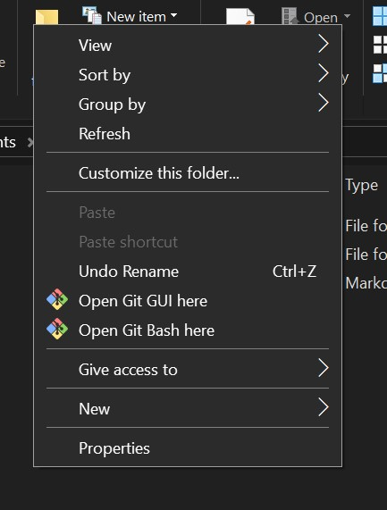
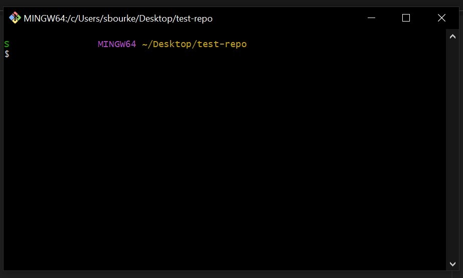

# Start coding on your machine

## Overview

Moving from coding in a browser based notebook like Kaggle to coding on your machine can be daunting, but there are a few managable steps to get going. This repository runs through basic setup, including configuring Git, using VSCode and some helpful extensions. 

## Getting started

This guide requires the following software:
- [Python](https://www.python.org/) - install the `Py` utility as part of setup.
- [Visual Studio Code](https://code.visualstudio.com/)
- [Git for Windows](https://git-scm.com/download/win) - which includes Git and Git Bash

## Contents

- [Key terms](#key-terms)
- [Part 1: Git, GitBash and GitHub](#part-1-git-gitbash-and-github)
    - [Starting Git Bash](#starting-git-bash)
    - [Configuring git](#configuring-git)
- [Part 2: Using Git](#part-2-using-git)
    - [Commands quick reference](#commands-quick-reference)
    - [Creating a local repository](#creating-a-new-local-repository)
    - [Checking status and adding files to tracking](#checking-status-and-adding-files-to-tracking)
    - [Making a commit](#making-a-commit)

### Key terms

Git - a version control system used to keep track of changes to files.
GitBash - a terminal for using Git on Windows.
GitHub - an online code storage platform and social network.
Repository - a single project with Git version control.
Commit - an action recorded in a repository.
Branch - a chain of commits. 

### Part 1: Git, GitBash and GitHub

One of the first things to get familiar with is the differences between Git, GitBash, and GitHub.

A simple way to think about it is:  
- Git is the system that keeps track of changes to code we are working on. 
- Git Bash is the application we use on our local computers to use Git. 
- GitHub is the online destination for our code so that others can view and work on it. GitHub also hosts a lot of open source projects that we can build on when creating new tools.

For now, we will use Git Bash to create a local repository.

#### Starting Git Bash

Create a new folder called `test-repo`.

Open Git Bash by right clicking inside the folder and selecting `Open Git Bash here`. (It can also be opened from the Windows search bar by searching for Git Bash.)

The open window should look something like this:  

#### Configuring Git

The next step is to configure some of the settings in Git.

Enter the following command:

    `$ git config --list`

This will print out a list of variables. 
From this list we want to configure your name, email, and default branch name. The default branch name may not make sense just yet, but will be explained soon. 

When adding your name and email, these will be the details that are added to `commits` that are added to the repository. Make sure the email address is the same as the one you will use for GitHub.

        $ git config --global user.name "Your name"
        $ git config --global user.email "youremail@domain.com"

Next set Visual Studio Code as your default text editor.

        $ git config --global core.editor "code --wait"

Finally, update the default branch name (which will be explained later).

        $ git config --global init.defaultbranch main

You can check these have been recorded correctly by finding the values in the list when running `git config --list` again. Note that if some values are shown twice, the final entry is the one Git will use.   

        diff.astextplain.textconv=astextplain
        filter.lfs.clean=git-lfs clean -- %f
        filter.lfs.smudge=git-lfs smudge -- %f
        filter.lfs.process=git-lfs filter-process
        filter.lfs.required=true
        http.sslbackend=openssl
        http.sslcainfo=C:/Users/sbourke/AppData/Local/Programs/Git/mingw64/etc/ssl/certs/ca-bundle.crt
        core.autocrlf=true
        core.fscache=true
        core.symlinks=false
        pull.rebase=false
        credential.helper=manager
        credential.https://dev.azure.com.usehttppath=true
        user.name=My Name
        user.email=myemail@domain.com
        init.defaultbranch=main

### Part 2. Using git

#### Commands quick reference

In the next section we will use the following commmands:

**Git commands**

- `git init` - Create a new repository
- `git status` - Check the current status of the working directory
- `git add <file>` - Stage a file that you want to commit a change to
- `git commit -m "Commit message"` - Update the repository based on changes.

**Other commands**

- `pwd` - prints the current directory
- `ls` - print a list of files and folders in the current directory.
- `cd <folder>` - change which folder you are in
- `mkdir <folder>` - Create a new folder within the current directory.
- `touch filename.txt` - create a new file with the title filename.txt.
- `start filename.txt` - start the file filename.txt.

#### Creating a new local repository

Each new Git project is called a `repository` and exists within a specific location, such as a folder on your computer.

To create a new repository inside `test-repo` folder enter the following command into git bash:

        git init

You will see a message `Initialized empty Git repository in <location_of_your_folder>`

This has created an empty repository that we can use for tracking code.

#### Checking status and adding files to tracking

A core command that you will use often is `git status`.
Enter the command now:

        git status

You should see the following:

        On branch main
        
        No commits yet

        nothing to commit (create/copy files and use "git add" to track)

To create a file we can use the command `touch` in Git Bash. Enter the following command:

        touch README.md

This creates a [readme file](https://docs.github.com/en/repositories/managing-your-repositorys-settings-and-features/customizing-your-repository/about-readmes) which should be added to every project to explain important information about the project. 
Now when you enter `git status` again you will see a different message the the README.md filename highlighted in red.

Now Git Bash will show 

        Untracked files:
          (use "git add <file>..." to include in what will be committed)
                README.md
        
        nothing added to commit but untracked files present (use "git add" to track)

To stage the file you need to enter:

        git add README.md

Then enter `git status`again to see the changes.

        Changes to be committed:
          (use "git rm --cached <file>..." to unstage)
                new file:   README.md

#### Making a commit 

The green text shows that the file is now recognised by Git. The final step is to `commit` the file into the repository. A commit is made up of the command `git commit` plus a flag `-m "Commit message"` which adds a commit message. Commit messages are important to quickly record what changes you have made. Add your commit with a commit message such as:

        git commit -m "Created README."

Now when we enter `git status` we will see the message:

        on branch main
        nothing to commit, working tree clean

This is the basic process for adding adding and tracking changes to files. 

Finally, to start the README in Visual Studio Code so that we can work on it enter:

        start README.md

