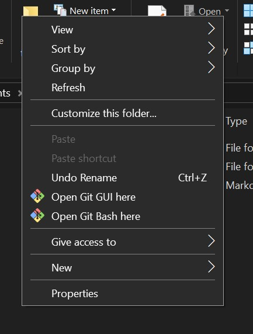
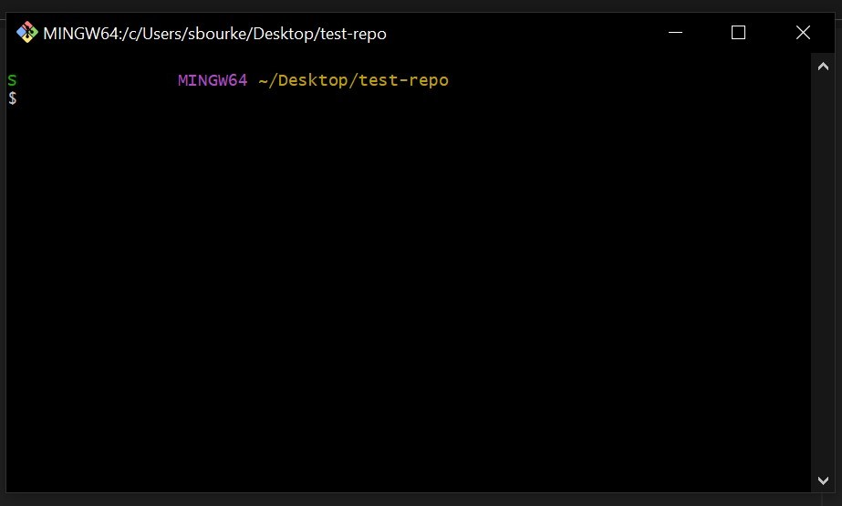
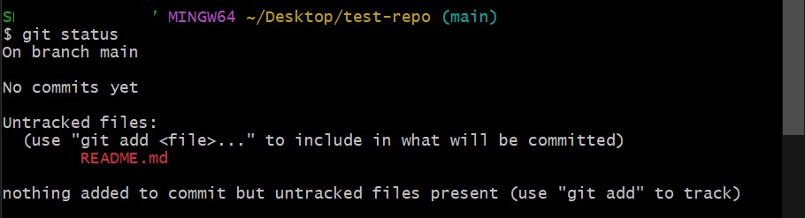
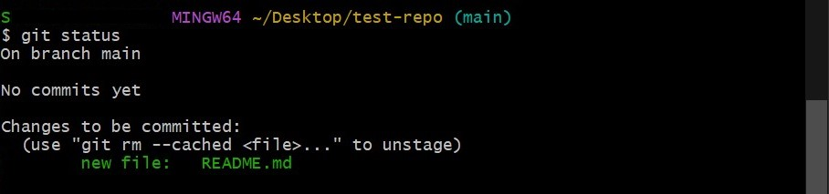

# Start coding on your machine

## Overview

Moving from coding in a browser to coding on your machine can be daunting, but there are a few steps to get going. 

This repository runs through part 1: using Git - including the difference between Git and GitHub, config, creating and updating a repository, and branches. 

## Requirements

This guide requires the following software:
- [Python](https://www.python.org/) - install the `Py` utility as part of setup
- [Visual Studio Code](https://code.visualstudio.com/) - which we will use more in future tutorials
- [Git for Windows](https://git-scm.com/download/win) - which includes Git and Git Bash

Also create GitHub account using your staff email. Follow the prompts to create a personal account [on GitHub](https://github.com/).

## Contents

- [Key terms](#key-terms)
- [Part 1: Git, GitBash and GitHub](#part-1-git-gitbash-and-github)
    - [Key terms](#key-terms)
    - [Starting Git Bash](#starting-git-bash)
    - [Configuring git](#configuring-git)
    - [Using Git](#using-git)
    - [Commands quick reference](#commands-quick-reference)
    - [Creating a local repository](#creating-a-new-local-repository)
    - [Checking status and adding files to tracking](#checking-status-and-adding-files-to-tracking)
    - [Making a commit](#making-a-commit)

## Part 1: Git, GitBash and GitHub

### Key terms

Git - a version control system used to keep track of changes to files.  
GitBash - a terminal for using Git on Windows.  
GitHub - an online code storage platform and social network.  
Repository - a single project with Git version control.  
Commit - an action recorded in a repository.  
Branch - a chain of commits.   

### Introduction

One of the first things to get familiar with is the differences between Git, GitBash, and GitHub.

A simple way to think about it is:  
- Git is a system that keeps track of changes to code we are working on. 
- Git Bash is the application that uses Git on a local computer. 
- GitHub is the online destination for code so that others can view and work on it. GitHub also hosts a lot of open source projects that we can build on when creating new tools.

For now, we will use Git Bash to create a local repository.

### Starting Git Bash

Open Git Bash by right clicking inside a folder and selecting `Open Git Bash here` or searching for Git Bash in the Windows search bar.

The open window will look something like this:  

Note that Git Bash shows  `$` on the line that commands are entered on. This can be a simple way to see if a command has finished.   
When a command in these instruction starts with `$` you don't need to transcribe it - it's there to differentiate between commands and code that might display.

### Configuring Git

The next step is to configure some settings.

Enter the following command:

    $ git config --list

This will print out a list of variables that will look something like this:  

        diff.astextplain.textconv=astextplain
        filter.lfs.clean=git-lfs clean -- %f
        filter.lfs.smudge=git-lfs smudge -- %f
        filter.lfs.process=git-lfs filter-process
        filter.lfs.required=true
        http.sslbackend=openssl
        http.sslcainfo=C:/Users/<username>/AppData/Local/Programs/Git/mingw64/etc/ssl/certs/ca-bundle.crt
        core.autocrlf=true
        core.fscache=true
        core.symlinks=false
        pull.rebase=false
        credential.helper=manager
        credential.https://dev.azure.com.usehttppath=true

The first step is to configure your name and email.   
This will be attached to your commits in each Git repository.   
Make sure the email address is the same as the one you use for GitHub.

        $ git config --global user.name "Your name"
        $ git config --global user.email "youremail@domain.com"

Next set Visual Studio Code as your default text editor.

        $ git config --global core.editor "code --wait"

Finally, update the default branch name to `main`. Git comes with the default branch name `master` - a term which has been re-evaluated due to its connection to slavery. Using `main` is a simple way to adopt more inclusive language. 

        $ git config --global init.defaultbranch main

You can check these have been recorded correctly by finding the values in the list when running `git config --list` again. Note that if some values are shown twice, the final entry is the one Git will use.   

For a more in depth look at this process, try the [Library Carpentry: Introduction to Git](https://librarycarpentry.org/lc-git/index.html) course.

### Using git

Using a terminal program like Git Bash requires using text commands to control the computer, rather than a graphical user interface (GUI). Some commands, such as `ls` (a command for listing files and folders in the current directory) can be run as a single command while others need a command and parameters. Git commands always need the prefix `git` so that the terminal knows what program is used.

### Commands quick reference

In the next section we will use the following Git commands:

**Git commands**

- `git init` - Create a new repository
- `git status` - Check the current status of the working directory
- `git add <file>` - Stage a file that you want to commit a change to
- `git commit -m "Commit message"` - Update the repository based on changes.
- See also the [GitHub Education Git Cheat Sheet pdf](https://education.github.com/git-cheat-sheet-education.pdf)

**Other useful commands**

- `pwd` - prints the current directory/folder
- `ls` - print a list of files and folders in the current directory
- `cd <folder>` - change which folder you are in
- `mkdir <folder>` - Create a new folder within the current directory
- `touch filename.txt` - create a new file with the filename filename.txt
- `start filename.txt` - open filename.txt

### Creating a new local repository

Start by creating a new folder for the repository called `test-repo`. Enter the following:

        $ mkdir test-repo

To move into the folder, use the command `cd` which means change directory:

        $ cd test-repo

Each new Git project is called a `repository` and exists within a specific location, such as the `test-repo` folder on your computer.

To create a new repository inside `test-repo` folder enter the following command into git bash:

        $ git init

You will see a message `Initialized empty Git repository in <location_of_your_folder>`

This has created an empty repository that we can use for tracking code.

### Checking status and adding files to tracking

A core command that you will use often is `git status`.
Enter the command now:

        $ git status

You should see the following:

        On branch main
        
        No commits yet

        nothing to commit (create/copy files and use "git add" to track)

To create a file we can use the command `touch` followed by the name of the file we want to create. For example:

        $ touch README.md

This creates a [readme file](https://docs.github.com/en/repositories/managing-your-repositorys-settings-and-features/customizing-your-repository/about-readmes) which should be added to every project to explain important information about it.

Now when you enter `git status` again you will see a different message the the README.md filename highlighted in red.

Now Git Bash will show:

... to include in what will be committed)
   README.md
nothing added to commit but untracked files present (use git add to track)" width="600"/>

To stage the file you need to enter:

        $ git add README.md

Then enter `git status` again to see the changes.

... to unstage)
       new file:   README.md" width="600"/>

### Making a commit 

The green text shows that the file is now recognised by Git. The final step is to `commit` the file into the repository. A commit is made up of the command `git commit` plus a flag `-m "Commit message"` which adds a commit message. Commit messages are important to quickly record what changes you have made. Add your commit with a commit message such as:

        $ git commit -m "Created README."

Now `git status` will show the message:

        on branch main
        nothing to commit, working tree clean

This is the basic process for adding adding and tracking changes to files. 

Finally, to open the README in Visual Studio Code so that we can work on it:

        $ start README.md

Add some text to the README, save it and try the `git status` process again.

This is the basic process for updating code.

### .gitignore and secrets

Data added to a Git repository is permanently part of that repository's history. This is great for understanding what decisions were made over time, but it creates a challenge for data that should not be shared online, such as passwords, API keys, or other sensitive information. This kind of data is often referred to as **secrets** and there are specific processes used to work with them. 

### .env files

These are text files with the filename `.env` that is, it only has a file extension as the whole filename. This file is used to store **environment variables** - any variables specific to the local setup of the program.   
`.env` files support comments `# like this comment`.  

        # environment variables
        "API_KEY" = "yourSecretKey"
        # Path to command line tool such as cmarcedit.exe
        "MarcEdit_path" = "C:/path/to/cmarcedit.exe"

To create a `.env` file in Git Bash enter:

        $ touch .env

Now notice how it shows up as an untracked file in Git when using the command `git status`. Do not add it to tracking.

### .gitignore files

To stop Git from noticing the `.env` file we need to create a `.gitignore` file. 

A gitignore file is a specific type of file that tells git what *not* to track. There are lots of patterns for these for example:

        # ignores .env files
        .env
        # ignores all text files
        *.txt
        # ignores all folders containing the word logs and their contents
        logs/
        # ignores any file or folder with the word secret in the name
        secret

These patterns can also use wildcard characters including `?` and `[0-9]` for a range of numbers. There are more examples 

**Try it**  
Create a `.gitignore` file using the `touch` command, open it using the `start` command, add a line in the file to stop tracking `.env` files and save.

Now re-run the `git status` command and see that the `.env` file no longer shows up as an untracked file.

## Adding a remote repository

The Library Carpentry tutorial will run through adding a remote repository. 

> Set up SSH
> git remote add origin <blah>
> pulling
> pushing

Library Carpentry have an in depth tutorial which includes how to set up SSH: [SSH Background and Setup](https://librarycarpentry.org/lc-git/03-sharing.html#ssh-background-and-setup)

## Creating a branch

> What is a branch
> Branch names
> Merge
> Merge conflicts
> Creating a branch if you've forgotten to make one

        $ git reset --hard origin/main

## Forking an existing repository

> Fork to their account
> Make some changes
> Push a commit