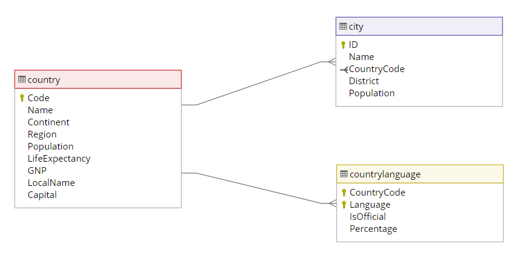

# Use SQL to find Carmen Sandiego
## Disclaimer
This SQL tutorial is based on content from the [Singapore Environment Institute (SEI) GitHub repository](https://github.com/wdi-sg/sql-carmen-sandiego/tree/master). It has been forked and adapted for SQLite. All original rights remain with the SEI, and State Library Victoria (SLV) does not claim ownership of the original content.

## Introduction
> ***Note:*** _This can be a pair programming activity or done independently._

#### Where In The World Is Carmen Sandiego?
This activity is an introduction to SQL. SQL commands will be used to chase down and capture an elusive and world-renowned thief, Carmen Sandiego. Follow the clues to figure out where Carmen's headed, so we can catch her and bring her in.

Please feel free to consult a [SQL Tutorial](https://www.w3schools.com/sql/) or [GenAI](https://chatgpt.com/) to assist your efforts.

## Exercise
#### Requirements & Setup
1. Download the sqlite database file and save to your local machine: [sql-carmen-sandiego.db](starter-code/sql-carmen-sandiego.db)
2. Navigate to [https://sqliteonline.com/](https://sqliteonline.com/) . This site will be used as a free online SQLite database environment. No account/signup is necessary.
3. Load the SQLite database by clicking on `File` --> `Open DB` and selecting the `sql-carmen-sandiego.db` file
4.  Confirm that you can see three table objects on the left hand pane: `city`, `country`, `countrylanguage`
5. Use the clues  and Entity Relationship Diagram (ERD) below to find Carmen Sandiego!

#### Entity Relationship Diagram
Please refer to the ERD diagram below for table relationships.


### The Clues

**Clue #1:** We recently got word that someone fitting Carmen Sandiego's description has been traveling through Southern Europe. She's most likely traveling someplace where she won't be noticed, so find the least populated country in Southern Europe, and we'll start looking for her there.

Hint: The `WHERE` clause is used to filter, and `ORDER BY` is used to sort a result set. `LIMIT` is used to restrict the number of rows returned.
  
<details>
<summary><b>Clue 1 Answer</b></summary>
  
 ```sql
SELECT code, name
FROM country 
WHERE region = 'Southern Europe' 
ORDER BY population
LIMIT 1;
```

</details>
<br />
<br />
<br />

**Clue #2:** Now that we're here, we have insight that Carmen was seen attending language classes in this country's officially recognized language. Check our database and find out what language is spoken in this country, so we can call in a translator to work with you.

<details>
<summary><b>Clue 2 Answer</b></summary>
  
 ```sql
SELECT language, isofficial
FROM countrylanguage 
WHERE countrycode = 'VAT';
```

</details>
<br />
<br />
<br />

**Clue #3:** We have new news on the classes Carmen attended: our gumshoes tell us she's moved on to a different country, a country where people speak *only* the language she was learning. Find out which nearby country speaks nothing but that language.

Hint: Refer to the `countrylanguage.percentage` column.

 <details>
<summary><b>Clue 3 Answer</b></summary>
  
 ```sql
SELECT countryCode, percentage
FROM countrylanguage 
WHERE language = 'Italian' 
ORDER BY percentage DESC;

SELECT name,code 
FROM country 
WHERE code = 'SMR';
```

</details>
<br />
<br />
<br />

**Clue #4:** We're booking the first flight out: maybe we've actually got a chance to catch her this time. There are only two cities she could be flying to in the country. One is named the *same* as the country – that would be too obvious. We're following our gut on this one; find out what other city in that country she might be flying to.

<details>
<summary><b>Clue 4 Answer</b></summary>
  
 ```sql
SELECT name 
FROM city 
WHERE countrycode = 'SMR'
AND name <> 'San Marino';
```

</details>
<br />
<br />
<br />

**Clue #5:** Oh no, she pulled a switch: there are two cities with very similar names, but in totally different parts of the globe! She's headed to South America as we speak; go find a city whose name is *like* the one we were headed to, but doesn't end the same. Find out the city, and do another search for what country it's in. Hurry!

Hint: `LIKE` can be used to perform wildcard searches.
<br />
Bonus: Rather than writing multiple queries, can you get the answer using a `JOIN`?

<details>
<summary><b>Clue 5 Answer - No JOIN</b></summary>
  
 ```sql
SELECT id, name, countryCode
FROM city 
WHERE name LIKE 'Serra%';

SELECT name, continent
FROM country 
WHERE code='BRA';
```

</details>

<details>
<summary><b>Clue 5 Answer - Using JOIN</b></summary>
  
 ```sql
SELECT country.name
FROM country
INNER JOIN city ON country.code = city.countrycode
WHERE country.region = 'South America'
and city.name LIKE 'Serra%';
```

</details>
<br />
<br />
<br />


**Clue #6:** We're close! Our South American agent says she just got a taxi at the airport, and is headed towards the capital! Look up the country's capital, and get there pronto! Send us the name of where you're headed and we'll follow right behind you!

Hint: Consider using a subquery.

<details>
<summary><b>Clue 6 Answer</b></summary>
  
 ```sql
SELECT name
FROM city 
WHERE id = (SELECT capital 
            FROM country
            WHERE code = 'BRA');
```

</details>
<br />
<br />
<br />

**Clue #7:** She knows we're on to her: her taxi dropped her off at the international airport, and she beat us to the boarding gates. We have one chance to catch her, we just have to know where she's heading and beat her to the landing dock. Lucky for us, she's getting cocky. She left us a note, and I'm sure she thinks she's very clever, but if we can crack it, we can finally put her where she belongs – behind bars.

```
  Our playdate of late has been unusually fun –
  As an agent, I'll say, you've been a joy to outrun.
  And while the food here is great, and the people – so nice!
  I need a little more sunshine with my slice of life.
  So I'm off to add one to the population I find
  In a city of ninety-one thousand and now, eighty five.
```

-  She's in ____________________________!

<details>
<summary><b>Clue 7 Answer</b></summary>
  
 ```sql
SELECT * 
FROM city 
WHERE population=91084;
```

</details>

<br />

<details>
<summary><b>Click here to view the final answer!</b></summary>
She's in Santa Monica, California, USA!

</details>


## Additional Resources
- [W3 Schools SQL Tutorial](https://www.w3schools.com/sql/)
- [Codecademy SQL Reference](https://www.codecademy.com/article/sql-commands)
